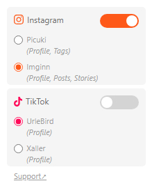

# Social Switch

Redirect Instagram and TikTok URLs to anonymous viewers. Access any profile, posts, tagged posts, stories profile or tags on Instagram or any profile on TikTok and the extension will redirect automatically to web viewers.

From **Instagram** URLs to **Picuki.com** or **Imginn.com**, and from **TikTok** URLs to **UrleBird.com** or **Xaller.com**.

> [!NOTE]
> For those seeking an alternative redirection for open-source instances, I recommend using the LibRedirect extension. The Social Switch extension aims to streamline access to web viewers that are more stable and facilitate the download of assets from both Instagram and TikTok. It targets users who prefer these anonymous but closed-source platforms.
>
> This extension is not affiliated with Instagram, TikTok, Picuki, Imginn, UrleBird and Xaller.

## Installation

## Usage

Select a viewer option and enable or disable redirection through the popup.

For Instagram post URLs (`instagram.com/p/short_code`) and Instagram stories profile URLs (`instagram.com/stories/handle`), regardless of the redirection option, the extension will redirect to Imginn.com. This viewer uses the original post short code, and it has the option to view only stories via URL. However, for tag URLs (`instagram.com/explore/tags/tag_name`), irrespective of the redirection option, the extension will redirect to Picuki.com, as only this viewer supports tag search.

### Supported URLs

- Instagram:

  `instagram.com/handle`

  `instagram.com/handle/tagged`

  `instagram.com/stories/handle` *(only Imginn)*

  `instagram.com/p/short_code` *(only Imginn)*

  `instagram.com/handle/p/short_code` *(only Imginn)*

  `instagram.com/reel/short_code` *(only Imginn)*

  `instagram.com/handle/reel/short_code` *(only Imginn)*

  `instagram.com/explore/tags/tag_name` *(only Picuki)*

- TikTok:

  `tiktok.com/@handle`

## Development

$ `git clone git@github.com:claromes/socialswitch.git`

$ `cd socialswitch`

The choice to use the `chrome.tabs` API is to avoid the blocking of redirection for certain paths by Instagram. Some tests still need to be conducted before implementing `chrome.webNavigation`, `chrome.webRequest` or `chrome.declarativeNetRequest`.

[List of each type of URL for testing](urls.md).

## Roadmap

- [x] Tags URL
- [x] Post URLs
- [ ] TikTok options
  - [x] User
  - [ ] Video
- [ ] Firefox Add-ons
- [ ] Add Integration Testing

## Credits

- [Claromes](https://claromes.com), author and maintainer
- [MagicPattern](https://unsplash.com/@magicpattern), background image of the [promotional assets](assets)
